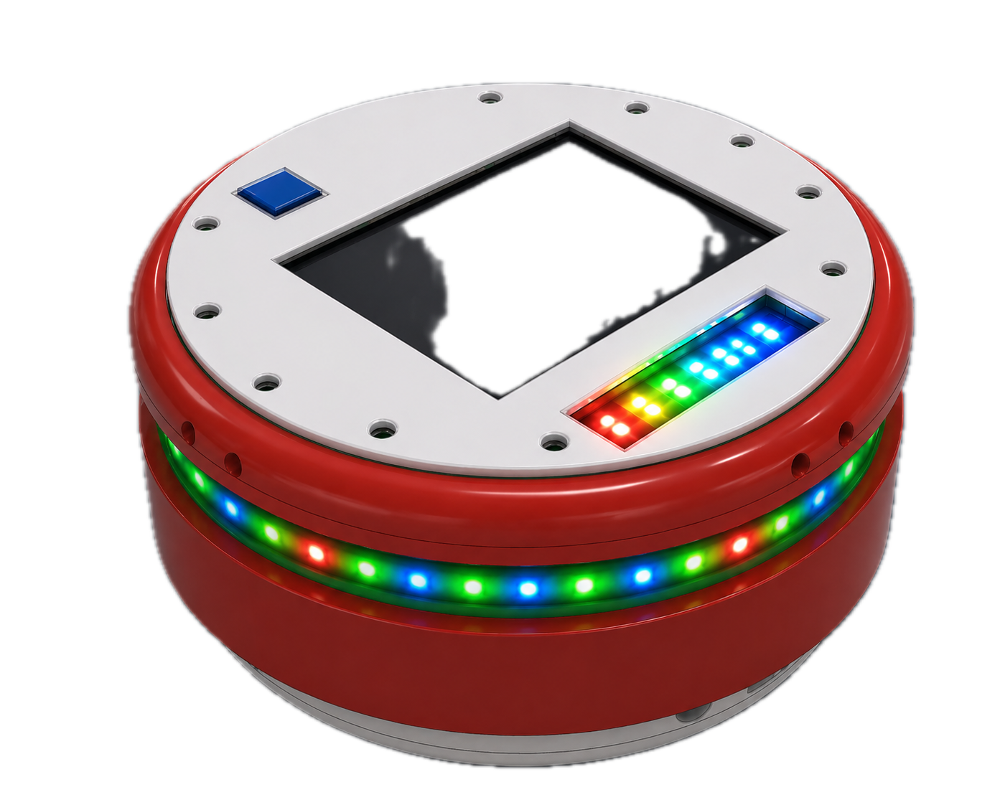
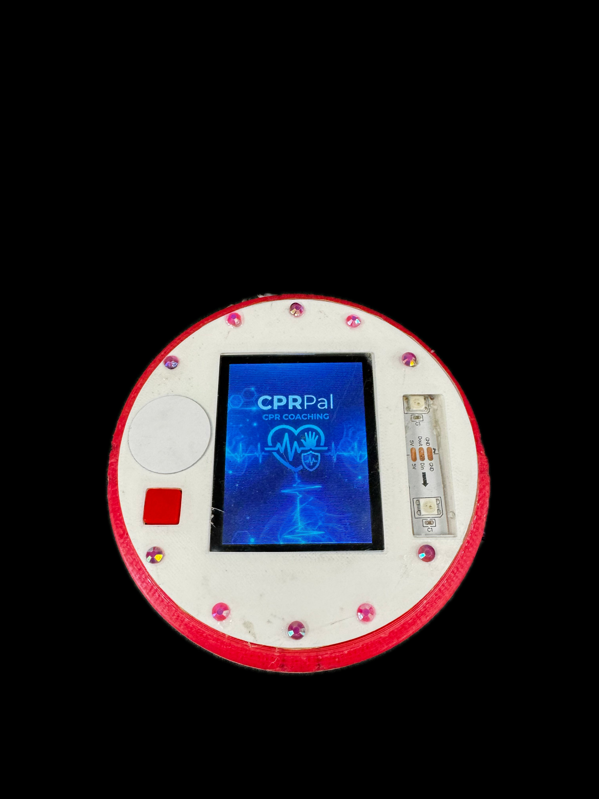
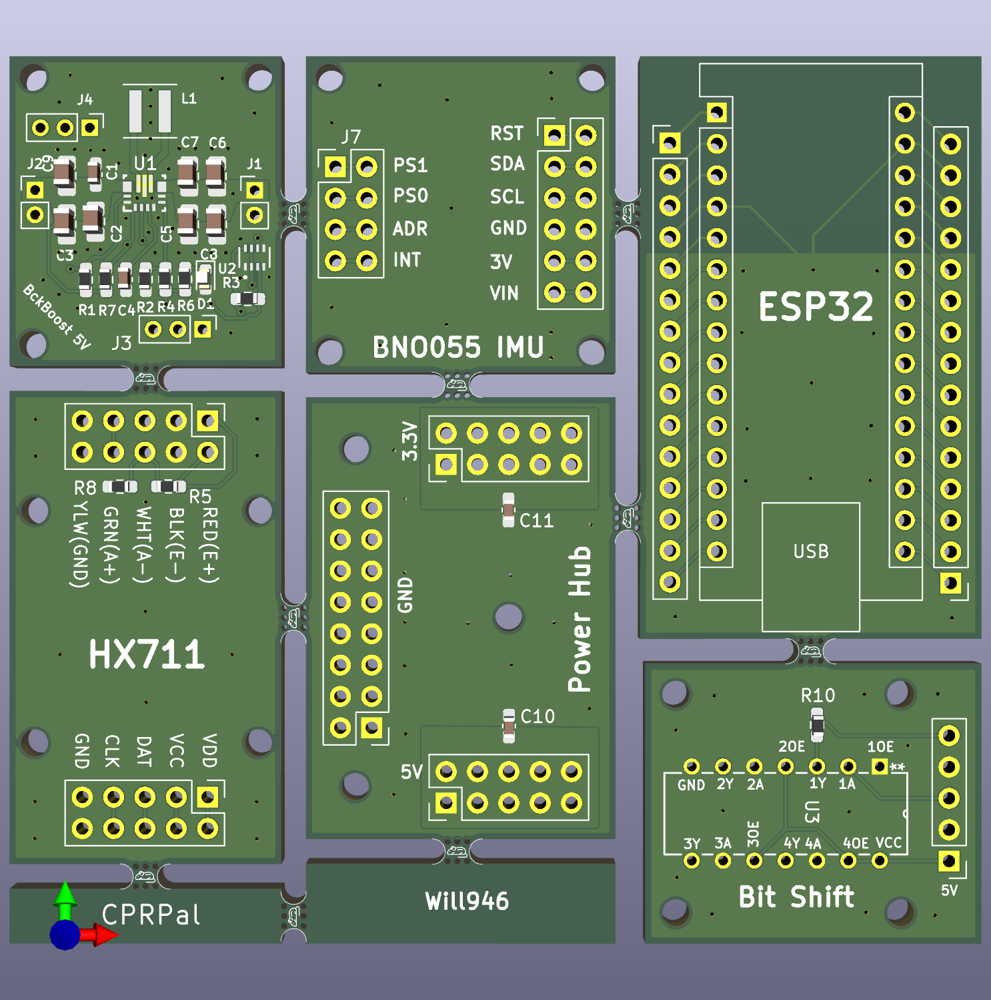

# CPRPal — Real-Time CPR Feedback and Training Device

---

## Table of Contents

- [Project Overview](#project-overview)
- [Repository Structure](#repository-structure)
- [System Architecture](#system-architecture)
- [Hardware Components](#hardware-components)
- [Wiring and Pin Assignments](#wiring-and-pin-assignments)
- [PCB Design](#pcb-design)
- [Firmware](#firmware)
- [Operating Modes](#operating-modes)
- [User Operation](#user-operation)
- [Signal Processing](#signal-processing)
- [Power System](#power-system)
- [Cloud and Web Application](#cloud-and-web-application)
- [Setup and Installation](#setup-and-installation)
- [Library Dependencies](#library-dependencies)


---

## Project Overview

CPRPal is a portable, puck-shaped CPR coaching device designed to help untrained bystanders and CPR trainees perform chest compressions with correct force, rhythm, and body positioning during a cardiac emergency or training session.

Sudden cardiac arrest is responsible for approximately 93% of out-of-hospital cardiac arrest deaths. Survival probability drops roughly 10% per minute without CPR or AED intervention, yet only about 3% of the U.S. population is CPR certified annually. CPRPal addresses this gap by providing real-time, easy-to-interpret feedback that requires no prior training to use.

The device is placed between the rescuer's hands and the patient's sternum during chest compressions. It measures compression force directly using a load cell, tracks body posture using a 9-DOF IMU, monitors for heartbeat presence using a PPG optical sensor, and delivers feedback through a color-coded NeoPixel LED ring, a 2.8" TFT LCD display, and a 100 BPM audio metronome buzzer.

**Emergency Mode** operates fully standalone with no Wi-Fi required, providing immediate real-time feedback the moment the button is pressed.

**Training Mode** connects to Wi-Fi, runs a 2-minute guided session, and uploads averaged session metrics to an Azure-hosted cloud dashboard for review.

The final prototype measures 4.7" x 4.7" x 2.4" and runs for over 15 hours on four AA batteries at a normal operating draw of approximately 155 mA.

| Rendering | Final Build |
|---|---|
|  |  | 


---

## Repository Structure

```
CPRPal/
├── 3DModel/
│   └── Mechanical enclosure and CAD files
│       - Top shell with lattice structure and LCD/button/LED cutouts
│       - Bottom shell with battery pocket, support beams, and hard stops
│       - Full assembly files for PLA 3D printing
│
├── ArduinoCode/
│   └── CPRPal.ino — Main ESP32 firmware (FreeRTOS-based)
│       - Sensor integration (HX711, BNO055, PPG)
│       - Real-time signal processing and CPM detection
│       - LED and display feedback systems
│       - Emergency and Training mode logic
│       - Power management and idle sleep
│       - HTTP cloud upload for training sessions
│
├── ArduinoWebsite/
│   └── Azure Static Web App source code
│       - Frontend dashboard (HTML/CSS/JS)
│       - Azure Function API endpoint
│       - Receives HTTP POST from ESP32
│       - Displays training session summary
│
├── PartsList/
│   └── Bill of Materials (BOM) and component references
│
└── PCBFiles/
    └── Full circuit schematics and PCB layout files
        - CPRPal_PCB_Sch — complete schematic
        - Panelized 6-board layout for JLCPCB fabrication
        - Custom PCB footprints and 3D component models
```

---

## System Architecture

CPRPal uses a dual-core FreeRTOS architecture on the Arduino Nano ESP32-S3.

### Core 0 — Sensor Acquisition and Processing

All time-critical sensor tasks run on Core 0 to prevent display rendering overhead from introducing jitter into sensor sampling.

| Task | Function | Sample Rate |
|---|---|---|
| `taskHX711` | Load cell reading, EMA filtering, CPM detection, idle detection | ~80 Hz |
| `taskIMU` | BNO055 orientation reading, tilt computation, posture status | ~40 Hz |
| `taskPPG` | PPG sampling, adaptive peak detection, BPM estimation | ~50 Hz |
| `taskBuzzer` | 100 BPM metronome via LEDC PWM, rhythm LED strip sync | 100 BPM |

### Core 1 — User Interface and Control

The Arduino `loop()` function runs on Core 1 and handles all output rendering:

- TFT display refresh at 10 Hz
- NeoPixel force bar graph refresh at 40 Hz
- Mode selection and session control logic
- Training session timer and metric accumulation
- Serial calibration commands

### Shared State and Synchronization

All shared sensor variables use the `g_` prefix, are declared `volatile`, and are protected by the FreeRTOS mutex `xDataMutex`. A second mutex `xWireMutex` serializes I2C bus access between `taskIMU` and any other bus user. This two-mutex architecture prevents data races while minimizing lock hold time.

---

## Hardware Components

| Component | Part | Purpose |
|---|---|---|
| Microcontroller | Arduino Nano ESP32-S3 | Main processing, Wi-Fi, dual-core FreeRTOS |
| Force Sensor | Half-bridge strain gauge load cell (120 lb) | Direct compression force measurement |
| Load Cell Amplifier | HX711 24-bit ADC | Amplifies and digitizes load cell signal at 80 SPS |
| IMU | Adafruit BNO055 9-DOF Fusion Breakout | Orientation, tilt detection, motion artifact rejection |
| Pulse Sensor | Pulse Sensor Amped (PPG) | Supplemental heartbeat detection |
| Display | Adafruit 2.8" ILI9341 TFT LCD | Real-time prompts and numeric status |
| LED Strips | Adafruit NeoPixel WS2812B (18 total) | Force bar (15 px) and rhythm metronome (3 px) |
| Buzzer | Piezo buzzer | 100 BPM audio metronome |
| Power Regulation | TPS63070 buck-boost converter x2 | Regulated 3.3V and 5V rails from 4xAA batteries |
| Reverse Protection | LM66200 ideal diode x2 | Prevents USB-to-battery reverse current |
| Storage | SanDisk 32GB microSD | Boot animation BMP frames |
| Battery | 4xAA alkaline | 10+ hours runtime at normal operating load |
| Enclosure | PLA 3D print | 4.7" x 4.7" x 2.4" puck housing |

---

## Wiring and Pin Assignments

### ESP32 GPIO Map

| Pin | Peripheral | Function |
|---|---|---|
| GPIO2 | HX711 CLK | Load cell clock |
| GPIO3 | HX711 DOUT | Load cell data |
| GPIO4 | SD Card CS | microSD chip select |
| GPIO6 (D6) | Start Button | Mode selection (active low, internal pull-up) |
| GPIO9 | ILI9341 DC | TFT data/command select |
| GPIO10 | ILI9341 CS | TFT chip select |
| GPIO19 | Buzzer | LEDC PWM channel 0, 2 kHz |
| GPIO21 | PPG LED indicator | Heartbeat flash LED |
| GPIO23 | PPG Sensor | Analog ADC input |
| GPIO2 (LED_PIN) | NeoPixel force bar | 15-pixel WS2812B data |
| GPIO4 (RHYTHM) | NeoPixel rhythm strip | 3-pixel WS2812B data |
| A4 (SDA) | BNO055 SDA | I2C data, 400 kHz |
| A5 (SCL) | BNO055 SCL | I2C clock, 400 kHz |

### I2C Bus

- BNO055 IMU address 0x28
- 10 kOhm pull-up resistors on SDA and SCL
- Bus speed 400 kHz (fast mode)
- External 32.768 kHz crystal for improved BNO055 sensor fusion accuracy

### SPI Bus

- ILI9341 TFT LCD: DC on GPIO9, CS on GPIO10
- microSD: CS on GPIO4
- Both share the hardware SPI bus

### Load Cell Wiring (Half-Bridge)

| Wire Color | HX711 Pin | Function |
|---|---|---|
| RED | E+ | Excitation positive |
| BLACK | E- | Excitation negative |
| WHITE | A- | Signal negative (differential) |
| GREEN | A+ | Signal positive (differential) |
| YELLOW | GND | Common ground reference |

Two 1 kOhm resistors on the HX711 board complete the Wheatstone bridge by providing the two fixed-impedance legs of the half-bridge configuration.

---

## PCB Design

CPRPal uses a custom panelized PCB fabricated by JLCPCB, separated into six press-fit sub-boards using mouse-bite breakaway tabs. Each sub-board can be removed and replaced independently without additional soldering.



### Sub-Board Summary

| Board | Key Components | Output |
|---|---|---|
| 3.3V BuckBoost | TPS63070, LM66200, 213k/365k feedback divider, decoupling caps, 1.5uH inductor | Regulated 3.3V rail |
| 5V BuckBoost | TPS63070, LM66200, alternate feedback divider, decoupling caps, 1.5uH inductor | Regulated 5V rail |
| Power Hub | Distribution headers, 10uF X5R decoupling caps x2 | Common power and ground plane |
| HX711 | HX711 IC, 1kOhm bridge resistors, DOUT/CLK headers | Load cell ADC interface |
| BNO055 IMU | BNO055 breakout, 10kOhm I2C pull-ups, 32.768kHz crystal | Euler angle outputs via I2C |
| ESP32 | Nano ESP32-S3 socket, USB passthrough | Main MCU |
| Bit Shift | Logic level shifter | 3.3V to 5V NeoPixel data translation |

### Component Footprints

#### 3.3V and 5V BuckBoost Boards
| Reference | Component | Footprint |
|---|---|---|
| U1 | TPS63070 — Buck-boost converter | SOT-23-8 |
| U2 | LM66200 — Ideal diode controller | SOT-23-6 |
| L1 | 1.5 µH inductor | Inductor_SMD 4x4mm |
| R1, R2 | Feedback divider resistors (213k / 365k for 3.3V; alternate values for 5V) | 0402 |
| R3 | Current sense resistor | 0402 |
| R4, R6, R7 | Bias/compensation resistors | 0402 |
| C1–C6 | Decoupling and compensation capacitors | 0402 |
| C7 | Output bulk capacitor | 0805 |
| D1 | Schottky diode | SOD-123 |
| J1, J2, J3, J4 | Power input/output headers | PinHeader 1x02 2.54mm |

#### Power Hub Board
| Reference | Component | Footprint |
|---|---|---|
| C10, C11 | 10 µF X5R decoupling capacitors | 0805 |
| J (3.3V) | 3.3V distribution header | PinHeader 2x05 2.54mm |
| J (5V) | 5V distribution header | PinHeader 2x05 2.54mm |
| J (GND) | Ground distribution header | PinHeader 1x08 2.54mm |

#### HX711 Board
| Reference | Component | Footprint |
|---|---|---|
| U1 | HX711 — 24-bit ADC | SOP-16 |
| R5, R8 | 1 kΩ Wheatstone bridge completion resistors | 0402 |
| J (VDD, VCC, DAT, CLK, GND) | MCU interface header | PinHeader 1x05 2.54mm |
| J (RED, BLK, WHT, GRN, YLW) | Load cell wire header | PinHeader 1x05 2.54mm |

#### BNO055 IMU Board
| Reference | Component | Footprint |
|---|---|---|
| U1 | BNO055 — 9-DOF IMU | LGA-28 (custom) |
| X1 | 32.768 kHz crystal | Crystal SMD 3.2x1.5mm |
| R1, R2 | 10 kΩ I2C pull-up resistors | 0402 |
| J7 | Configuration header (PS0, PS1, ADR, INT) | PinHeader 1x04 2.54mm |
| J (RST, SDA, SCL, GND, 3V, VIN) | MCU interface header | PinHeader 1x06 2.54mm |

#### ESP32 Board
| Reference | Component | Footprint |
|---|---|---|
| U1 | Arduino Nano ESP32-S3 | Custom dual-row female socket, 2x15 2.54mm |
| J (USB) | USB-C passthrough cutout | USB-C receptacle footprint |
| J (left, right) | GPIO breakout headers | PinHeader 1x15 2.54mm x2 |

#### Bit Shift Board
| Reference | Component | Footprint |
|---|---|---|
| U3 | 74AHCT125 — Quad level shifter | SOIC-14 |
| R10 | Pull-down resistor | 0402 |
| J (input) | 3.3V NeoPixel data input header | PinHeader 1x02 2.54mm |
| J (output) | 5V NeoPixel data output header | PinHeader 1x02 2.54mm |
| J (VCC, GND) | Power headers | PinHeader 1x02 2.54mm |

### Power Architecture

Two independent TPS63070 buck-boost converters are used instead of a single converter with an LDO post-regulator. This improves efficiency across the full 4xAA discharge range (approximately 6V fully charged to 4.8V near end of life), since the buck-boost topology maintains tight output regulation without the linear losses an LDO would introduce at shrinking headroom.

- 3.3V rail powers: ESP32-S3, BNO055 IMU, PPG sensor, piezo buzzer
- 5V rail powers: ILI9341 LCD, NeoPixel strips (18 px total), HX711 amplifier

---

## Firmware

The firmware is a single Arduino sketch located in `ArduinoCode/CPRPal.ino`. It is written in C++ using the Arduino framework for ESP32 and relies on FreeRTOS task management, mutex-protected shared state, and the ESP32's LEDC hardware PWM peripheral for the buzzer metronome.

### Key Constants

```cpp
// Force feedback thresholds (lbs)
const float FORCE_THRESHOLD_LB      = 30.0f;   // Rising edge detection
const float FORCE_LOW_OK            = 75.0f;   // Below = TOO LIGHT (yellow)
const float FORCE_HIGH_OK           = 110.0f;  // Above = TOO STRONG (red)

// CPM thresholds
const float CPM_LOW_OK              = 100.0f;  // Below = TOO SLOW
const float CPM_HIGH_OK             = 120.0f;  // Above = TOO FAST
const unsigned long CPM_DEBOUNCE_MS = 180UL;   // Anti-bounce window
const int CPM_INTERVAL_COUNT        = 6;       // Rolling average window size

// Tilt feedback
const float TILT_WARN_DEG           = 8.0f;    // Above = ADJUST

// Timing
const unsigned long IDLE_TIMEOUT_MS     = 20000UL;  // 20s inactivity -> idle
const unsigned long TRAINING_SESSION_MS = 120000UL; // 2-minute session
const unsigned long TRAINING_SAMPLE_MS  = 3000UL;   // Sample every 3s
const unsigned long TRAINING_HOLD_MS    = 3000UL;   // Button hold -> Training

// Buzzer metronome
#define BUZZER_FREQ_HZ    2000  // 2 kHz tone
#define BUZZER_BEEP_MS    30    // On-time per beat in ms
#define BUZZER_PERIOD_MS  600   // Full period = 100 BPM

// Load cell
float calibration_factor = 6500; // Raw counts per pound-force (empirical)
```

### Live Serial Calibration Commands

The calibration factor can be adjusted without reflashing firmware using the Serial Monitor at 115200 baud:

| Key | Action |
|---|---|
| `+` or `a` | Increase calibration factor by 10 |
| `-` or `z` | Decrease calibration factor by 10 |
| `t` or `T` | Tare the scale (zero current load) |
| `r` or `R` | Reset session peak weight |

### EMA Filter

Raw load cell readings are smoothed before any threshold detection:

```
w_filtered[n] = 0.75 * w_filtered[n-1] + 0.25 * w_raw[n]
```

Smoothing factor alpha = 0.25 was chosen empirically to balance noise rejection against compression onset detection latency.

### CPM Detection Algorithm

1. EMA-filtered force crosses above FORCE_THRESHOLD_LB (30 lb) — rising edge detected
2. 180ms debounce window prevents double-counting from signal ringing near threshold
3. Inter-edge interval converted to instantaneous CPM: `CPM = 60000 / delta_t_ms`
4. Stored in 6-entry circular buffer; rolling CPM = arithmetic mean of buffer entries
5. If no compression detected for 2000ms, CPM resets to zero and buffer clears

### IMU Baseline Calibration

On startup, 100 BNO055 orientation samples are captured (after 50 warm-up discards) and averaged as the resting baseline. All subsequent readings are deltas from this baseline so tilt feedback is relative to device placement on the patient, not absolute gravity direction.

- Tilt magnitude = sqrt(delta_roll² + delta_pitch²)
- Above 5 degrees triggers ADJUST on LCD
- Above 10 degrees triggers LEAN on LCD

### PPG Detection Algorithm

1. ADC sampled at ~50 Hz, 12-bit resolution, 3.6V full-scale attenuation
2. 10-sample moving average applied for noise reduction
3. Adaptive baseline tracks slow DC component of signal
4. Adaptive peak envelope tracks signal upper bound
5. Beat detected on rising edge exceeding 55% of amplitude above baseline
6. Flag resets when signal falls below 35% of amplitude (hysteresis)
7. BPM = average of 4 most recent valid inter-beat intervals
8. BPM zeroed after 3.5s without a detected beat
9. Finger contact confirmed when ADC reading exceeds FINGER_ON threshold (1700)

---

## Operating Modes

### Boot Sequence

On power-on the device performs the following sequence automatically:

1. Serial initialization and reset reason diagnostic printout to serial monitor
2. I2C bus initialization at 400 kHz on pins A4 and A5
3. BNO055 initialization and external crystal enable
4. SPI bus and TFT display initialization
5. Boot animation — 8 BMP frames loaded sequentially from microSD, 1.25s per frame
6. NeoPixel strip initialization at 40/255 brightness
7. HX711 initialization, power-up, and tare to zero
8. FreeRTOS sensor tasks spawned on Core 0
9. Mode selection screen displayed
10. User selects mode via button
11. IMU orientation baseline captured in current resting position

### Emergency Mode

Activated by a short press of the start button.

- Wi-Fi fully disabled — no radio activity during emergency
- 100 BPM metronome starts immediately
- Live CPM, force, tilt, and PPG status shown on TFT display
- NeoPixel force bar updates at 40 Hz
- After 20s of inactivity (no load cell change exceeding 10 lb), all sensor tasks are suspended in RAM and device enters software idle mode at approximately 95 mA
- To wake: hold button for 2 seconds; all peripherals reinitialize and device returns to mode selection

### Training Mode

Activated by holding the button for 3 seconds.

- Wi-Fi connection attempted with 10s timeout
- If no network found: graceful offline fallback, session runs locally, no upload at end
- 2-minute timed session with countdown timer displayed on LCD bottom-right
- Sensor metrics sampled every 3s into running sum accumulators
- At session end: averages computed, JSON serialized manually, HTTP POST sent to Azure endpoint
- Session summary displayed on LCD regardless of upload success
- Wi-Fi fully shut down after upload; device returns to mode selection

---

## User Operation

### Emergency Mode Step-by-Step

1. Remove CPRPal from first aid kit and slide power switch on. Keep device still on a flat surface during the ~5 second boot and IMU calibration sequence.
2. Call 911 immediately or direct a bystander to call. Do not delay emergency services.
3. Place CPRPal face-up on the center of the patient's chest, between the nipple line, with the LCD visible to you.
4. Short-press the start button once. Emergency Mode begins and the metronome starts at 100 BPM.
5. Place both hands on top of the device and compress in time with the beep and amber LED ring.
6. Watch the side LED bar: yellow = push harder, green = good depth, red = ease up.
7. Watch LCD TILT row: ADJUST or LEAN means recheck your body position and ensure force is going straight down.
8. Watch LCD PPG row: Heartbeat detect means consider pausing to reassess for pulse.
9. Continue compressions until EMS arrives or AED is ready.

### Training Mode Step-by-Step

1. Power on and hold button for 3 seconds until "Training selected" appears on LCD.
2. Device connects to Wi-Fi and displays IP address on successful connection.
3. Scan QR code on device or navigate to the dashboard URL on a phone or computer.
4. Begin compressions following the same LED and LCD feedback as Emergency Mode.
5. 2-minute countdown timer shown at bottom right of LCD throughout session.
6. At session end, summary shown on LCD and data uploaded to dashboard if Wi-Fi available.

### Feedback Reference

| Channel | States | Meaning |
|---|---|---|
| LCD — CPM | WAITING / TOO SLOW / GOOD / TOO FAST | Compression rate guidance toward 100-120 CPM |
| LCD — Force | TOO LIGHT / GOOD / TOO STRONG | Compression depth guidance toward AHA target |
| LCD — Tilt | GOOD / ADJUST / LEAN | Posture and off-axis warning |
| LCD — PPG | BPM value / Heartbeat detect / Missing heartbeat | Supplemental pulse status |
| NeoPixel bar | Yellow / Green / Red | Visual force classification |
| Buzzer + rhythm LEDs | 100 BPM beep + amber flash | Compression pacing metronome |

---

## Signal Processing

### Force Classification

| Force Range | LED Color | LCD Status | Meaning |
|---|---|---|---|
| < 5 lb | Off | — | No significant contact |
| 5–75 lb | Yellow | TOO LIGHT | Insufficient compression force |
| 75–110 lb | Green | GOOD | Target depth range |
| > 110 lb | Red | TOO STRONG | Excessive force |

### CPM Classification

| CPM Range | LCD Status |
|---|---|
| < 1 | WAITING |
| 1–99 | TOO SLOW |
| 100–120 | GOOD |
| > 120 | TOO FAST |

### Tilt Classification

| Tilt Magnitude | LCD Status |
|---|---|
| < 5 degrees | GOOD |
| 5–10 degrees | ADJUST |
| > 10 degrees | LEAN |

---

## Power System

### Rail Assignments

| Rail | Powered Components |
|---|---|
| 3.3V | ESP32-S3, BNO055 IMU, PPG sensor, piezo buzzer |
| 5V | ILI9341 LCD, NeoPixel strips (18 px total), HX711 amplifier |

### Power Budget

| Operating Mode | Current Draw | Notes |
|---|---|---|
| Peak startup | ~235 mA | Boot animation with full brightness LEDs and LCD |
| Normal (Emergency Mode) | ~155 mA | Colored LEDs at 40/255, dim LCD, all sensors active |
| Idle (tasks suspended) | ~95 mA | LCD dim showing idle screen, ESP32 running, all else off |
| Training Mode | ~195 mA | Normal + 40 mA Wi-Fi radio, no idle mode |

At 155 mA normal draw with a 2700 mAh 4xAA pack, theoretical runtime is approximately 17 hours. Measured battery life exceeded 10 hours under mixed-use testing.

---

## Cloud and Web Application

### Dashboard URL

```
https://gentle-stone-0c20e761e.6.azurestaticapps.net/
```

The dashboard is a static web application hosted on Microsoft Azure Static Web Apps using the free tier only. No charges are incurred.

### Data Flow

```
ESP32 collects sensor data every 3s during Training Mode session
  -> Averages computed at 2-minute session end
  -> JSON payload manually serialized (no external library)
  -> HTTP POST to Azure Function API endpoint
  -> Azure processes and stores payload
  -> Dashboard displays session summary
```

### JSON Payload Format

```json
{
  "deviceId": "nano-esp32-test",
  "timestamp": "123456789",
  "mode": "TRAINING",
  "sessionType": "summary",
  "ppg": 1800,
  "imuY": 2.5,
  "imuZ": -1.2,
  "compressionRate": 110,
  "compressionDepth": 85.3,
  "recoil": 1,
  "status": "Good compressions",
  "sampleCount": 40,
  "sessionDurationMs": 120000
}
```

### Status String Logic

| Condition | Status Field Value |
|---|---|
| Rate > 125 CPM or depth > 6.2 lb | `"Bad: too fast/deep"` |
| Rate < 100 CPM or depth < 5.0 lb or recoil == 0 | `"Warn: shallow/recoil"` |
| All within range | `"Good compressions"` |

### Offline Fallback

If Wi-Fi is unavailable when Training Mode is entered:

1. Device displays offline warning on LCD
2. Full 2-minute session runs locally with all normal feedback active
3. Session summary displayed on LCD at session end
4. HTTP POST upload skipped

---

## Setup and Installation

### Requirements

- Arduino IDE 2.x
- Arduino ESP32 board package installed via Boards Manager
  - Search for `esp32` by Espressif Systems
  - Select board: **Arduino Nano ESP32**

### Step 1 — Install Required Libraries

Open Arduino IDE and go to Sketch -> Include Library -> Manage Libraries. Search for and install each of the following:

| Library | Author |
|---|---|
| Adafruit BNO055 | Adafruit |
| Adafruit BusIO | Adafruit |
| Adafruit EPD | Adafruit |
| Adafruit FT6206 Library | Adafruit |
| Adafruit GFX Library | Adafruit |
| Adafruit HX8357 Library | Adafruit |
| Adafruit ILI9341 | Adafruit |
| Adafruit ImageReader Library | Adafruit |
| Adafruit NeoMatrix | Adafruit |
| Adafruit NeoPixel | Adafruit |
| Adafruit seesaw Library | Adafruit |
| Adafruit SH110X | Adafruit |
| Adafruit SPIFlash | Adafruit |
| Adafruit SSD1331 OLED Driver Library for Arduino | Adafruit |
| Adafruit SSD1351 library | Adafruit |
| Adafruit ST7735 and ST7789 Library | Adafruit |
| Adafruit STMPE610 | Adafruit |
| Adafruit TouchScreen | Adafruit |
| Adafruit TSC2007 | Adafruit |
| Adafruit Unified Sensor | Adafruit |
| HX711 | bogde |
| PulseSensor Playground | World Famous Electronics |
| SdFat - Adafruit Fork | Adafruit |

> WiFi and HTTPClient are included with the ESP32 Arduino core and do not require separate installation.

### Step 2 — Prepare the microSD Card

The boot animation requires 8 BMP image files placed in the root of a FAT32-formatted microSD card. Name the files exactly as follows:

```
/Step0.bmp
/Step1.bmp
/Step2.bmp
/Step3.bmp
/Step4.bmp
/Step5.bmp
/Step6.bmp
/Step7.bmp
```

Each image should be a 24-bit BMP at 240x320 pixels to match the ILI9341 display resolution. If the SD card fails to mount, the firmware will halt and display an error on the TFT screen.

### Step 3 — Configure Wi-Fi Credentials

Open `ArduinoCode/CPRPal.ino` and locate the following lines near the top of the file:

```cpp
const char* WIFI_SSID     = "YOUR_SSID_HERE";
const char* WIFI_PASSWORD = "YOUR_PASSWORD_HERE";
```

Replace with your Wi-Fi network credentials. Wi-Fi is only used during Training Mode. Emergency Mode runs fully offline regardless of these settings.

> Note: The ESP32 posts directly to the Azure cloud endpoint over any internet-connected Wi-Fi network. The viewing device does not need to be on the same network as the ESP32.

### Step 4 — Select Board and Port

In Arduino IDE:

1. Go to Tools -> Board -> esp32 -> Arduino Nano ESP32
2. Go to Tools -> Port -> select the correct COM port for your device
3. If the board is not recognized, hold the BOOT button on the ESP32 while connecting USB

### Step 5 — Flash Firmware

Click Upload in Arduino IDE. Open the Serial Monitor at 115200 baud to view boot diagnostics, reset reason history, sensor readings, and calibration output.

### Step 6 — Calibrate the Load Cell

1. Power on the device and let it boot fully
2. Open Serial Monitor at 115200 baud
3. Place a known weight on the device
4. Use `+` and `-` keys in Serial Monitor to adjust calibration factor until the displayed value matches the known weight
5. Note the final calibration factor and update `calibration_factor` in the sketch to save it permanently

---

## Library Dependencies

| Library | Purpose in CPRPal |
|---|---|
| Adafruit BNO055 | BNO055 IMU driver and Euler angle output |
| Adafruit BusIO | I2C/SPI abstraction layer required by Adafruit sensor libraries |
| Adafruit GFX Library | Core graphics primitives for TFT display rendering |
| Adafruit ILI9341 | ILI9341 TFT display driver |
| Adafruit ImageReader Library | BMP image loading from SD card for boot animation |
| Adafruit NeoPixel | WS2812B addressable LED control for force bar and rhythm strip |
| Adafruit NeoMatrix | NeoPixel matrix support (dependency) |
| Adafruit Unified Sensor | Unified sensor abstraction required by BNO055 driver |
| Adafruit SPIFlash | SPI flash support (alternative storage backend) |
| SdFat - Adafruit Fork | SD card FAT filesystem for microSD BMP loading |
| Adafruit EPD | E-paper display support (dependency) |
| Adafruit FT6206 Library | Capacitive touchscreen support (dependency) |
| Adafruit HX8357 Library | HX8357 display driver (dependency) |
| Adafruit seesaw Library | Adafruit seesaw breakout support (dependency) |
| Adafruit SH110X | OLED display driver (dependency) |
| Adafruit SSD1331 OLED Driver | SSD1331 OLED support (dependency) |
| Adafruit SSD1351 library | SSD1351 OLED support (dependency) |
| Adafruit ST7735 and ST7789 Library | ST77xx display drivers (dependency) |
| Adafruit STMPE610 | Touch controller support (dependency) |
| Adafruit TouchScreen | Resistive touchscreen support (dependency) |
| Adafruit TSC2007 | Touch controller support (dependency) |
| HX711 by bogde | HX711 load cell amplifier driver |
| PulseSensor Playground | PPG pulse sensor signal processing |

*CPRPal is a prototype device developed for educational purposes. It is not a certified medical device. Always call emergency services first in a cardiac emergency.*
